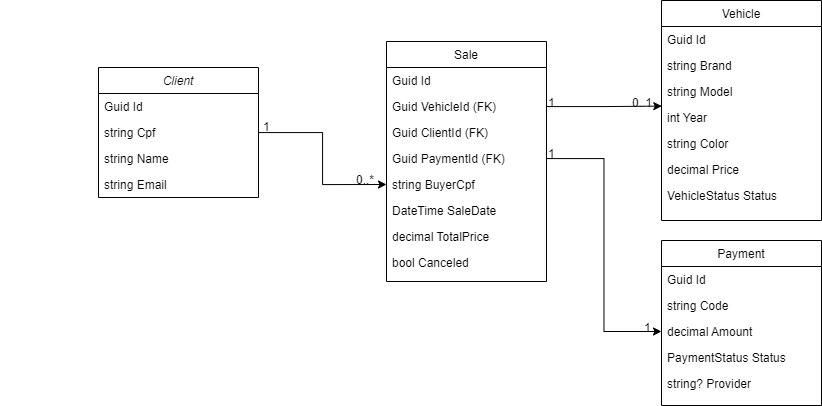

# DriveSale (API de Revenda de Veiculos)

Plataforma de API para revenda de veiculos automotores. Implementada em C# (.NET 9) com Clean Architecture, EF Core (PostgreSQL), documentacao OpenAPI/Swagger e manifests Kubernetes. Inclui Docker Compose para ambiente local com Postgres e Adminer.

## Projeto
- Endpoints para:
  - Cadastrar/editar veiculos e clientes
  - Efetuar venda (cria pagamento pendente)
  - Atualizar pagamento via webhook: status paid/canceled
  - Listar veiculos disponiveis ou vendidos, ordenados por preco (asc)
- Documentacao via Swagger (OpenAPI) e healthcheck simples.

## Como foi implementado
- Clean Architecture com quatro camadas:
  - Domain: entidades ricas (Vehicle, Sale, Payment, Client), enums e value object `Cpf`
  - Application: casos de uso com MediatR (Commands/Queries) e interfaces (Repos/UoW)
  - Infrastructure: EF Core + Npgsql (DbContext, Configurations, Repositories, UnitOfWork, Migrations)
  - WebApi: controllers finos, DI, Swagger e health
- Migracoes: migration inicial incluida e aplicada automaticamente no startup (`Database.Migrate()`).
- Docker Compose: Servicos `pgdb` (Postgres), `adminer` (UI) e `api` (WebApi container).
- Kubernetes: manifests prontos (ConfigMap, Secret, Deployment, Service).

## Estrutura do repositorio
```
DriveSale.sln
src/
  Domain/            # Entidades, Enums, ValueObjects, Base
  Application/       # Commands/Queries (MediatR), Interfaces, DTOs
  Infrastructure/    # EF Core, DbContext, Configurations, Repositories, Migrations
  WebApi/            # Controllers, Program.cs, Swagger, appsettings
k8s/                 # Manifests K8s
scripts/             # Scripts Docker Compose e EF
docker-compose.yml   # Compose (pgdb, adminer, api)
```

## Como usar localmente

Opcao A - VS Code (API no host)
- Requisitos: .NET SDK 9, Docker (para subir Postgres com Compose)
- Passos:
  - VS Code + Run Task + `compose-up` ou `compose-up-build`
  - F5 (perfil ".NET Launch WebApi")
  - Swagger: `http://localhost:5000/swagger`
  - Connection string do debug: `.vscode/launch.json` (ajuste se necessario)

Opcao B - Docker Compose (API + Postgres no Docker)
- `docker compose up -d --build` ou VS Code + Run Task + `compose-up-build`
- API: `http://localhost:8080/swagger`
- Adminer: `http://localhost:8081` (System: PostgreSQL, Server: `pgdb`, User: `postgres`, Password: `postgres`, Database: `fase2`)

Tarefas uteis (VS Code + Run Task)
- Compose: `compose-up`, `compose-up-recreate`, `compose-up-build`, `compose-down`
- EF: `ef-tool-install`, `ef-migrations-add`, `ef-database-update`, `ef-add-and-update`

## Banco de dados e Migracoes
- Ha uma migration inicial em `src/Infrastructure/Migrations/*` aplicada no startup.
- Para criar novas migracoes:
  - Task: `ef-migrations-add` (informe o nome) e depois `ef-database-update`, ou
  - Script: `scripts/ef-add-update.ps1 -InstallTool -Name MinhaMigration`

## Endpoints principais
Base: `/api`

Veiculos
- POST `/vehicles`  cria veiculo
- PUT `/vehicles/{id}`  edita (somente se disponivel)
- GET `/vehicles?status=available|sold`  lista por preco (asc)
- GET `/vehicles/{id}`  detalhe

Clientes
- POST `/clients`  cria cliente (CPF valido)
- PUT `/clients/{id}`  atualiza nome/email
- GET `/clients/{id}`  detalhe

Vendas
- POST `/sales`  cria venda + payment pendente
  - Body: `{ vehicleId, buyerCpf, saleDate? }`
  - Retorno: `{ id, totalPrice, paymentCode, paymentStatus }`
- GET `/sales/{id}`  detalhe

Webhook Pagamentos
- POST `/webhooks/payments/{paymentCode}`
  - Body: `{ "status": "paid" | "canceled", "provider"?: "..." }`
  - Resposta: 202 Accepted (idempotente)

Health
- GET `/health`

## Como testar
Use o Swagger (UI) ou `src/WebApi/WebApi.http`. Fluxo sugerido:

1) Criar cliente
```
POST /api/clients
{
  "name": "Joao Silva",
  "email": "joao@exemplo.com",
  "cpf": "111.444.777-35"
}
```

2) Cadastrar veiculo
```
POST /api/vehicles
{
  "brand": "Fiat",
  "model": "Argo",
  "year": 2022,
  "color": "Prata",
  "price": 65000
}
```

3) Listar disponiveis
```
GET /api/vehicles?status=available
```

4) Registrar venda (guarde o `paymentCode`)
```
POST /api/sales
{
  "vehicleId": "<id do veiculo>",
  "buyerCpf": "11144477735"
}
```

5) Simular pagamento via webhook
```
POST /api/webhooks/payments/{paymentCode}
{
  "status": "paid"
}
```

6) Listar vendidos
```
GET /api/vehicles?status=sold
```

7) Consultar venda
```
GET /api/sales/{id}
```

Observacoes
- Validacoes de dominio: CPF valido; nao editar veiculo vendido; venda somente com veiculo disponivel; webhook idempotente.
- HTTP: 201 (criado), 202 (webhook), 204 (update), 400/422 (validacoes), 404 (nao encontrado), 409 (conflito).

## Kubernetes
- Manifests em `k8s/`: `configmap.yaml`, `secret.yaml`, `deployment.yaml`, `service.yaml`.
- Ajuste a imagem no Deployment antes de aplicar.

## Solucao de problemas
- 28P01 (senha invalida):
  - `compose-down` (remove volumes) + `compose-up-build` para recriar banco com a senha do compose
  - Teste com Adminer (Server: `pgdb`) ou `psql` usando a mesma connection string
- Porta 5432 ocupada: altere a porta publicada no `docker-compose.yml` e atualize a connection string
- HTTPS no dev: projeto roda em HTTP no debug. Para HTTPS, gere/confie o certificado: `dotnet dev-certs https --trust`

## Arquitetura e Fluxo


## cURL/REST examples

Defina a base conforme o ambiente:
- VS Code (debug): `BASE=http://localhost:5000`
- Docker Compose: `BASE=http://localhost:8080`

PowerShell
```
$env:BASE="http://localhost:5000"
```

Bash
```
export BASE=http://localhost:5000
```

Criar cliente
```
curl -s -X POST %BASE%/api/clients ^
  -H "Content-Type: application/json" ^
  -d "{\"name\":\"Joao Silva\",\"email\":\"joao@exemplo.com\",\"cpf\":\"111.444.777-35\"}"
```

Obter cliente por id
```
curl -s %BASE%/api/clients/{id}
```

Atualizar cliente
```
curl -s -X PUT %BASE%/api/clients/{id} ^
  -H "Content-Type: application/json" ^
  -d "{\"name\":\"Joao Atualizado\",\"email\":\"joao@exemplo.com\"}"
```

Criar veiculo
```
curl -s -X POST %BASE%/api/vehicles ^
  -H "Content-Type: application/json" ^
  -d "{\"brand\":\"Fiat\",\"model\":\"Argo\",\"year\":2022,\"color\":\"Prata\",\"price\":65000}"
```

Listar veiculos disponiveis / vendidos
```
curl -s %BASE%/api/vehicles?status=available
curl -s %BASE%/api/vehicles?status=sold
```

Obter veiculo por id
```
curl -s %BASE%/api/vehicles/{id}
```

Atualizar veiculo
```
curl -s -X PUT %BASE%/api/vehicles/{id} ^
  -H "Content-Type: application/json" ^
  -d "{\"brand\":\"Fiat\",\"model\":\"Argo\",\"year\":2023,\"color\":\"Branco\",\"price\":64000}"
```

Criar venda (guarde o paymentCode do retorno)
```
curl -s -X POST %BASE%/api/sales ^
  -H "Content-Type: application/json" ^
  -d "{\"vehicleId\":\"{vehicleId}\",\"buyerCpf\":\"11144477735\"}"
```

Aplicar webhook de pagamento (paid/canceled)
```
curl -s -X POST %BASE%/api/webhooks/payments/{paymentCode} ^
  -H "Content-Type: application/json" ^
  -d "{\"status\":\"paid\"}"
```

Obter venda por id
```
curl -s %BASE%/api/sales/{id}
```
